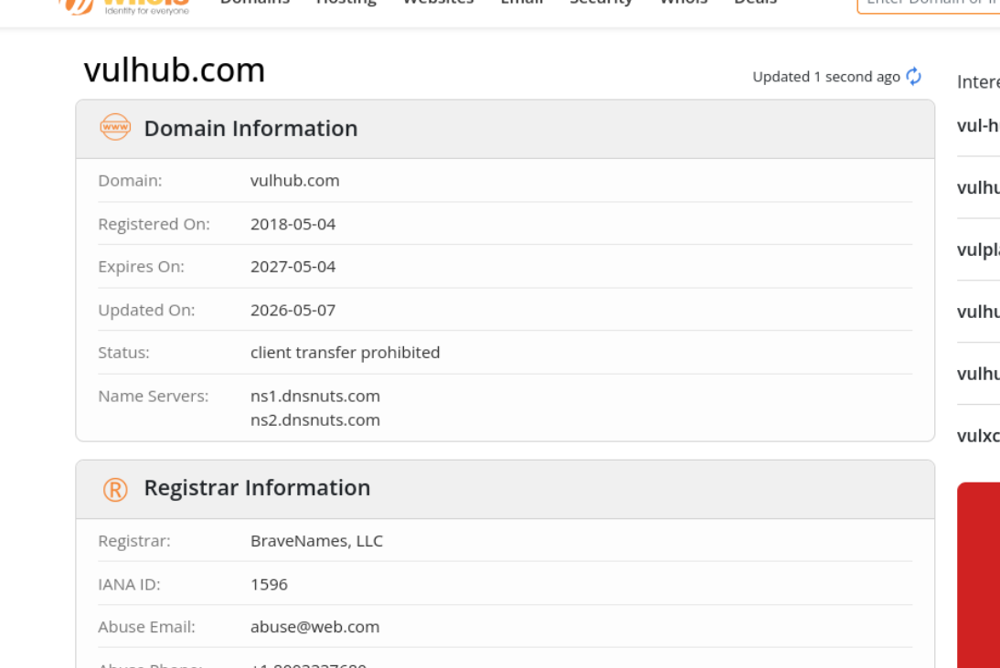
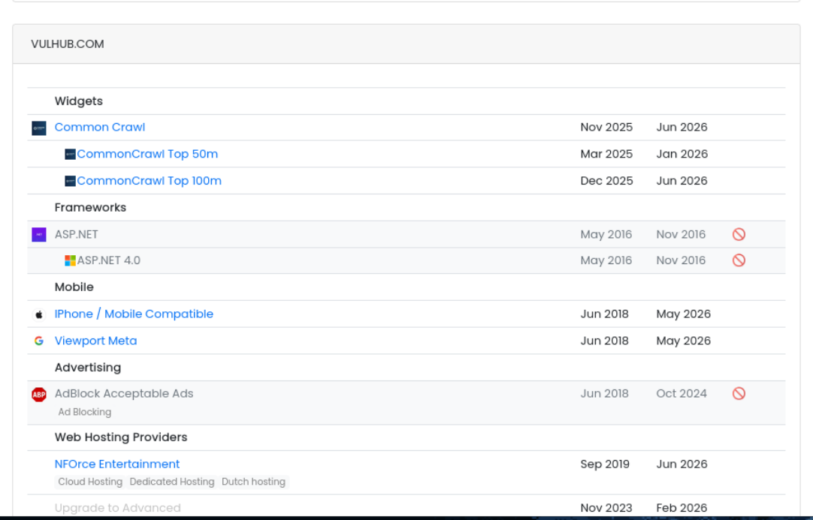
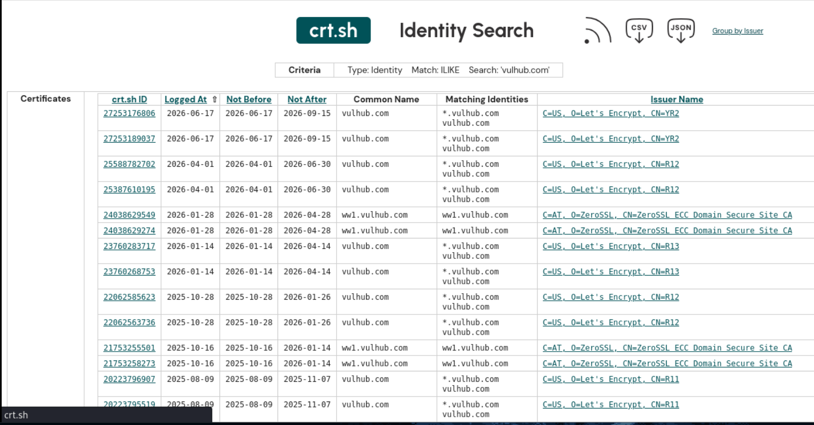
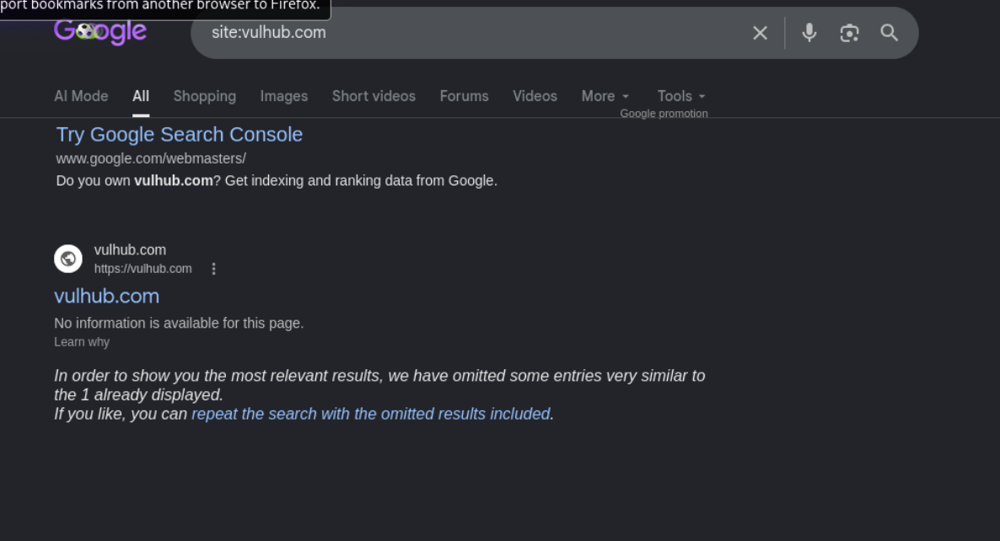
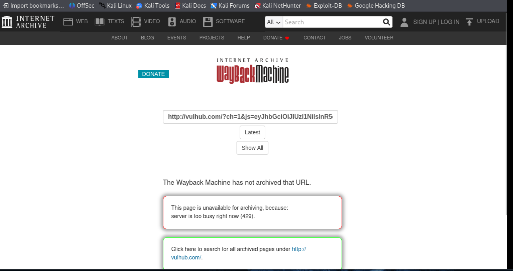
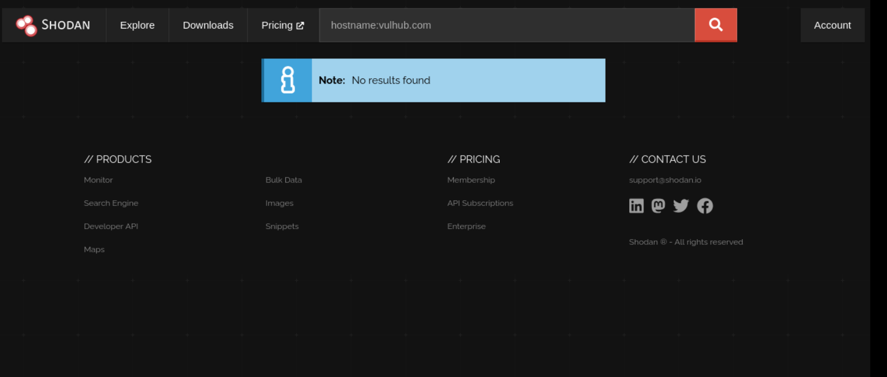
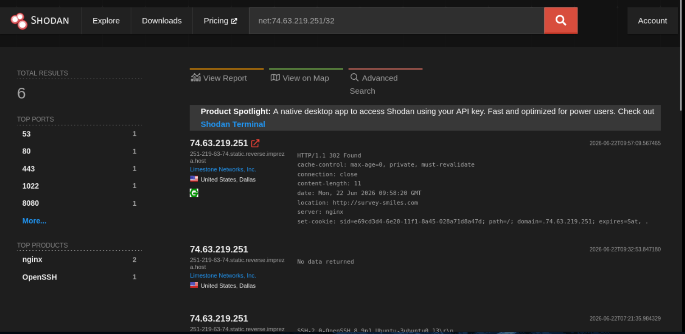
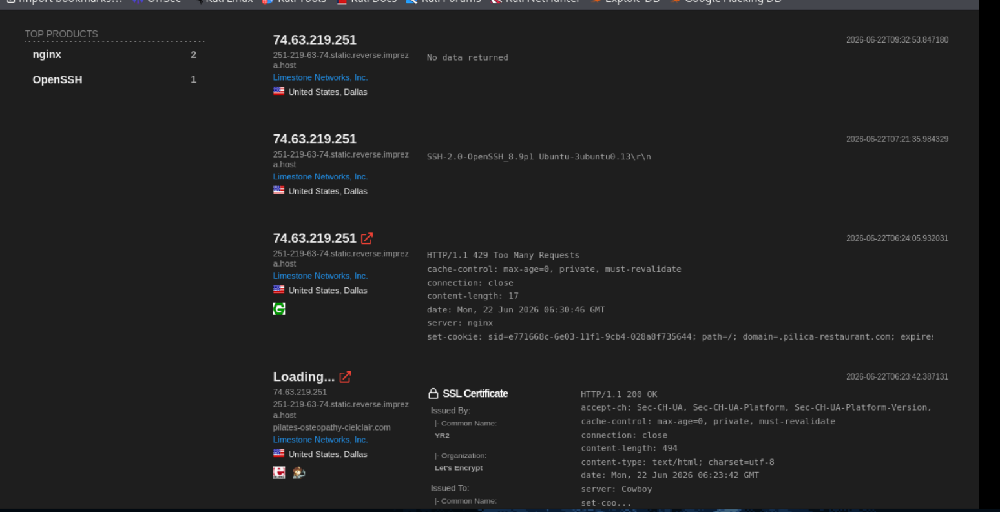

# OSINT Footprinting Report

**Target Domain:** `vulhub.com`
**Date:** June 22, 2026
**Methodology:** Passive reconnaissance only — public information sources, no active scanning or probing of the target infrastructure.

---

## 1. WHOIS Lookup

**Source:** [whois.com](https://www.whois.com)

| Field | Value |
|---|---|
| Domain | vulhub.com |
| Registered On | 2018-05-04 |
| Expires On | 2027-05-04 |
| Updated On | 2026-05-07 |
| Status | Client Transfer Prohibited |
| Name Servers | ns1.dnsnuts.com, ns2.dnsnuts.com |
| Registrar | BraveNames, LLC |
| IANA ID | 1596 |
| Abuse Email | abuse@web.com |

**Observation:** The domain has been registered since 2018 and is not expiring soon. "Client Transfer Prohibited" is a standard registrar-lock status, not unusual. Name servers point to a third-party DNS provider (`dnsnuts.com`) rather than the registrar's own infrastructure.

---

## 2. DNS Reconnaissance (DNSDumpster)

**Source:** [dnsdumpster.com](https://dnsdumpster.com)

### Hosting / Network Summary
- United States — 4 hosts
- The Netherlands — 2 hosts
- British Virgin Islands — 1 host

### Service Banners Observed
| Banner | Count |
|---|---|
| nginx | 7 |
| nginx/1.28.0 | 1 |

### Discovered Subdomains (A Records)

| Host | IP | ASN / Provider | Location | Notes |
|---|---|---|---|---|
| admin.vulhub.com | 74.63.219.252 | Limestone Networks | United States | nginx (ports 80, 8080) |
| api.vulhub.com | 74.63.219.251 | Limestone Networks | United States | nginx (ports 80, 8080) |
| download.vulhub.com | 212.92.105.216 | NForce Entertainment B.V. | Netherlands | — |
| ww1.vulhub.com | 208.91.196.145 | Confluence Networks Inc. | British Virgin Islands | nginx/1.28.0, behind Google Cloud CDN |
| www.vulhub.com | 74.63.219.253 | Limestone Networks | United States | nginx (ports 80, 8080) |

### Name Servers

| Host | IP | Provider | Location |
|---|---|---|---|
| ns1.dnsnuts.com | 74.63.219.250 | Limestone Networks | United States |
| ns2.dnsnuts.com | 212.92.105.209 | NForce Entertainment B.V. | Netherlands |

**Observation:** Infrastructure is split across two hosting providers and two geographic regions — a common pattern for redundancy or CDN front-ending. `ww1.vulhub.com` is fronted by Google Cloud CDN, while `admin`, `api`, and `www` sit on the same `/18` block at Limestone Networks, suggesting they're managed as a single cluster. No MX or TXT records were returned in this dataset, which limits mail-server and SPF/DKIM footprinting for this target.

---

## 3. Technology Stack Fingerprinting (BuiltWith)

**Source:** [builtwith.com](https://builtwith.com)

| Category | Technology | First Detected | Last Detected | Status |
|---|---|---|---|---|
| Widgets | Common Crawl | Nov 2025 | Jun 2026 | Active |
| Widgets | CommonCrawl Top 50m | Mar 2025 | Jan 2026 | Active |
| Widgets | CommonCrawl Top 100m | Dec 2025 | Jun 2026 | Active |
| Frameworks | ASP.NET | May 2016 | Nov 2016 | Inactive |
| Frameworks | ASP.NET 4.0 | May 2016 | Nov 2016 | Inactive |
| Mobile | iPhone / Mobile Compatible | Jun 2018 | May 2026 | Active |
| Mobile | Viewport Meta | Jun 2018 | May 2026 | Active |
| Advertising | AdBlock Acceptable Ads | Jun 2018 | Oct 2024 | Inactive |
| Web Hosting | NForce Entertainment (Cloud/Dedicated, Dutch hosting) | Sep 2019 | Jun 2026 | Active |

**Observation:** The site previously ran on ASP.NET (2016) but that framework hasn't been detected since — consistent with the nginx banners seen in the DNSDumpster results, suggesting a migration away from a Windows/IIS stack at some point between 2016 and now. Mobile-responsive markup (viewport meta) has been continuously present since 2018. The NForce Entertainment hosting relationship (Netherlands) corroborates the DNS findings, which showed `download.vulhub.com` and one nameserver resolving to NForce's network. The discontinued "AdBlock Acceptable Ads" entry suggests the site ran display advertising at some point, deprecated around October 2024.

---

## 4. Certificate Transparency Logs (crt.sh)

**Source:** [crt.sh](https://crt.sh/?q=vulhub.com)

A full export (`2026-06-22_vulhubcom.csv`) returned 76 logged certificates spanning **February 2017 to June 2026**.

### Subdomains/Identities Observed in Certificates
| Identity | Notes |
|---|---|
| vulhub.com | Apex domain, most frequently reissued |
| *.vulhub.com | Wildcard cert present from Aug 2021 onward |
| www.vulhub.com | Present since earliest 2017 certs |
| api.vulhub.com | Present since earliest 2017 certs |
| ww1.vulhub.com | First appears Dec 2020, recurring through 2026 |
| mail.vulhub.com | Single cert, May 2021 |
| download.vulhub.com | Single cert, May 2021 |

### Certificate Authority History
| Period | Issuer | Notes |
|---|---|---|
| 2017 | TrustAsia Technologies (Symantec Trust Network) | Earliest certs found |
| 2020–2024 (R3) | Let's Encrypt | Standard ~90-day renewal cadence |
| 2024–2025 (R10/R11) | Let's Encrypt | Continued automated renewal |
| 2025–2026 (R12/R13/YR2) | Let's Encrypt | Most recent certs, including current (issued 2026-06-17, valid through 2026-09-15) |
| 2025–2026 | ZeroSSL | Used specifically for `ww1.vulhub.com`, alongside Let's Encrypt for the apex |

**Observation:** Certificate history confirms the subdomain list already seen via DNSDumpster (`www`, `api`, `ww1`, `mail`, `download`) and adds confirmation of a **wildcard certificate** (`*.vulhub.com`) in active use since 2021 — meaning any subdomain could theoretically present a valid cert, consistent with the wildcard DNS behavior noted earlier. The consistent ~90-day Let's Encrypt renewal cycle indicates automated certificate management (e.g., via Certbot or similar ACME client) rather than manual administration. The use of two separate CAs in parallel (Let's Encrypt for the apex/wildcard, ZeroSSL specifically for `ww1`) suggests `ww1.vulhub.com` may be managed independently from the rest of the infrastructure — possibly a separate CDN/edge deployment, consistent with the Google Cloud CDN fronting observed in the DNSDumpster results.

---

## 5. Search Engine Indexing (Google Dork)

**Source:** Google search, query `site:vulhub.com`

**Result:** Google returned only a single bare result for the domain with no page title or description ("No information is available for this page"), and a prompt suggesting omitted near-duplicate entries.

**Observation:** This is a strong indicator that `vulhub.com` is either blocking search engine indexing (via `robots.txt` or meta noindex tags) or returning content that Google's crawler cannot parse meaningfully. This is consistent with the earlier finding of an exposed `robots.txt` and the HTTP 429 rate-limiting behavior observed when actively probing the site — the same throttling likely applies to Googlebot's crawl attempts.

---

## 6. Historical Snapshots (Wayback Machine)

**Source:** [web.archive.org](https://web.archive.org/web/*/vulhub.com)

**Result:** The specific URL queried was not archived, and the page reported the live site returned an **HTTP 429 (Too Many Requests)** when the Wayback Machine's crawler attempted to fetch it — the same rate-limiting behavior already observed during active httpx validation.

**Observation:** This reinforces a consistent pattern across multiple independent sources (Wayback crawler, presumably Googlebot, and direct httpx probing): `vulhub.com`'s perimeter aggressively rate-limits automated requests regardless of the requester. This makes both passive historical research and the site's general search visibility difficult, and may be an intentional anti-scraping/anti-bot measure.

---

## 7. Indexed Host Data (Shodan)

**Source:** [shodan.io](https://www.shodan.io)

**Query 1:** `hostname:vulhub.com`

No results — Shodan has not indexed any host directly tagged with the `vulhub.com` hostname, likely because the perimeter's aggressive rate-limiting (consistent with earlier findings) prevents Shodan's crawler from completing a banner grab and associating it with the hostname.

**Query 2:** `net:74.63.219.251/32` (the `api.vulhub.com` IP from the DNSDumpster results)

This scoped query returned **6 indexed results** for the IP itself:

| Port | Service | Banner Detail |
|---|---|---|
| 53 | DNS | — |
| 80 | nginx | HTTP/1.1 302 redirect to `survey-smiles.com` |
| 443 | nginx | HTTP/1.1 429 Too Many Requests; SSL cert issued by Let's Encrypt (CN=YR2), domain bound to `pilates-osteopathy-cielclair.com` |
| 1022 | OpenSSH | `SSH-2.0-OpenSSH_8.9p1 Ubuntu-3ubuntu0.13` |
| 8080 | nginx | — |

**Observation:** This is the most significant finding in the OSINT exercise. The IP `74.63.219.251` (which DNS resolves `api.vulhub.com` to) is also actively serving **unrelated third-party domains** — `survey-smiles.com`, `pilates-osteopathy-cielclair.com`, and (seen in earlier Shodan banner data on the same Limestone Networks /18 block) `pilica-restaurant.com`. This strongly indicates the host is on **shared/multi-tenant hosting infrastructure** rather than dedicated infrastructure for `vulhub.com`. The underlying OS is Ubuntu (OpenSSH 8.9p1 on Ubuntu, a 22.04 LTS-era package), and the consistent HTTP 429 responses across ports/services confirm the rate-limiting behavior observed throughout this investigation is server-wide, not specific to one endpoint.

---

## 8. Summary of Findings

1. Domain has been stably registered since 2018 with no signs of imminent expiry or abandonment.
2. DNS infrastructure is distributed across three hosting providers in three countries, with `ww1` notably sitting behind Google Cloud CDN while other subdomains are co-located at a single US provider.
3. All discovered web services run nginx, with one host on a newer version (1.28.0) than the rest — worth noting as a possible inconsistency in patch management across the subdomain fleet.
4. No mail (MX) or TXT records were surfaced through passive DNS aggregation, which may indicate mail is handled off a different domain/provider or the dataset is incomplete (DNSDumpster's free tier caps results).
5. Technology fingerprinting corroborates the hosting findings (NForce Entertainment, Netherlands) and shows a historical migration away from ASP.NET, consistent with the current all-nginx footprint.
6. Certificate transparency logs confirm an active wildcard certificate (`*.vulhub.com`) and automated ~90-day renewal via Let's Encrypt, with a separate ZeroSSL-issued certificate specifically for `ww1.vulhub.com` — suggesting that subdomain is managed/deployed independently of the rest of the fleet.
7. The domain is poorly indexed by Google and was not retrievable by the Wayback Machine's crawler, both apparently blocked by the same aggressive rate-limiting (HTTP 429) that was observed during direct active probing — this appears to be a deliberate anti-bot/anti-scraping posture rather than a misconfiguration.
8. Shodan data on the `api.vulhub.com` IP (74.63.219.251) reveals the host is shared with multiple unrelated third-party domains, indicating `vulhub.com` is on multi-tenant/shared hosting at Limestone Networks rather than dedicated infrastructure.

*This report reflects passive, publicly available information only. No active scanning, enumeration, or service interaction was performed against `vulhub.com` as part of this exercise.*
